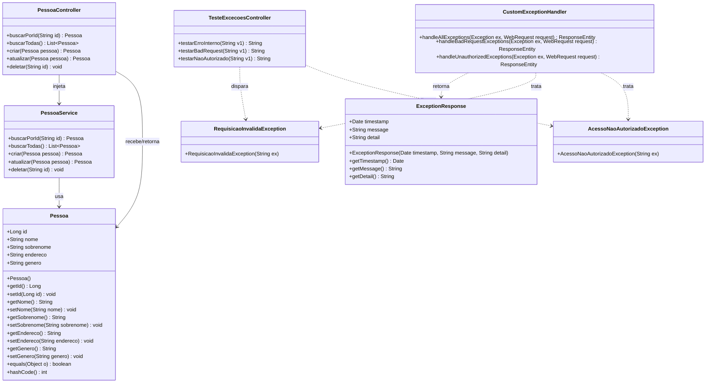

# UML da API GestaoPessoas2026

```mermaid
classDiagram
    class Pessoa {
        +Long id
        +String nome
        +String sobrenome
        +String endereco
        +String genero
        +Pessoa()
        +getId() Long
        +setId(Long id) void
        +getNome() String
        +setNome(String nome) void
        +getSobrenome() String
        +setSobrenome(String sobrenome) void
        +getEndereco() String
        +setEndereco(String endereco) void
        +getGenero() String
        +setGenero(String genero) void
        +equals(Object o) boolean
        +hashCode() int
    }

    class PessoaService {
        +buscarPorId(String id) Pessoa
        +buscarTodas() List~Pessoa~
        +criar(Pessoa pessoa) Pessoa
        +atualizar(Pessoa pessoa) Pessoa
        +deletar(String id) void
    }

    class PessoaController {
        +buscarPorId(String id) Pessoa
        +buscarTodas() List~Pessoa~
        +criar(Pessoa pessoa) Pessoa
        +atualizar(Pessoa pessoa) Pessoa
        +deletar(String id) void
    }

    class TesteExcecoesController {
        +testarErroInterno(String v1) String
        +testarBadRequest(String v1) String
        +testarNaoAutorizado(String v1) String
    }

    class ExceptionResponse {
        +Date timestamp
        +String message
        +String detail
        +ExceptionResponse(Date timestamp, String message, String detail)
        +getTimestamp() Date
        +getMessage() String
        +getDetail() String
    }

    class RequisicaoInvalidaException {
        +RequisicaoInvalidaException(String ex)
    }

    class AcessoNaoAutorizadoException {
        +AcessoNaoAutorizadoException(String ex)
    }

    class CustomExceptionHandler {
        +handleAllExceptions(Exception ex, WebRequest request) ResponseEntity
        +handleBadRequestExceptions(Exception ex, WebRequest request) ResponseEntity
        +handleUnauthorizedExceptions(Exception ex, WebRequest request) ResponseEntity
    }

    PessoaController --> PessoaService : injeta
    PessoaService --> Pessoa : usa
    PessoaController --> Pessoa : recebe/retorna
    TesteExcecoesController ..> RequisicaoInvalidaException : dispara
    TesteExcecoesController ..> AcessoNaoAutorizadoException : dispara
    CustomExceptionHandler ..> ExceptionResponse : retorna
    CustomExceptionHandler ..> RequisicaoInvalidaException : trata
    CustomExceptionHandler ..> AcessoNaoAutorizadoException : trata
```
